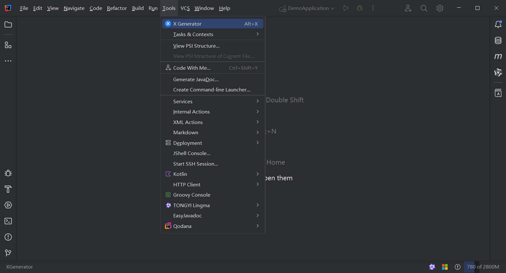
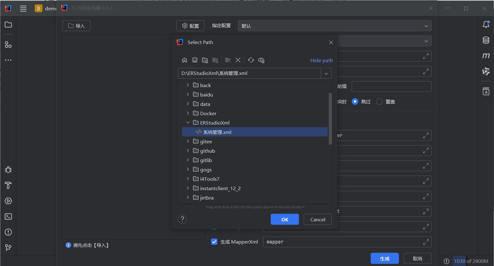
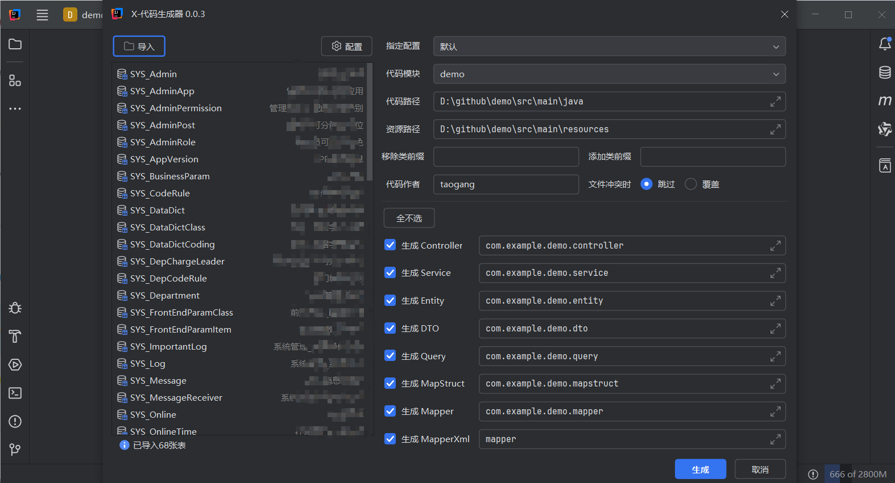

# X-Generator
X代码生成器，支持导入特定格式的xml文件，通过自动识别项目结构，生成Controller, Service, ServiceImpl, Entity, Mapper, Mapper.xml 等Java通用代码。


## 1、介绍
Java领域目前市面上常用的代码生成器大概有这几类：

- Web项目，通过运行系统，配置相关的表结构和数据库连接，来生成代码；
- IDE 插件，通过连接数据源，根据数据结构来生成代码；
- 直接运行代码，通过引入相关第三方SDK或者自己开发生成模板代码的方式来生成；

本插件基于IDEA的插件来生成Java通用模板代码，自动寻找当前项目模块、操作系统信息，实现生成的代码能直接运行的代码生成器。

## 2、支持的XML模板
```xml
<?xml version="1.0" encoding="GB2312" ?>
<Data>
    <Table Name="SYS_User" Text="系统用户表">
        <Column PrimaryKey="True" Name="UserId" Text="用户Id" DataType="VARCHAR" NullOption="False" DataLength="32"/>
        <Column PrimaryKey="False" Name="UserName" Text="用户名称" DataType="VARCHAR" NullOption="False" DataLength="100"/>
    </Table>
    <Table Name="SYS_Post" Text="系统岗位">
        <Column PrimaryKey="True" Name="PostId" Text="岗位Id" DataType="VARCHAR" NullOption="False" DataLength="32"/>
        <Column PrimaryKey="False" Name="PostName" Text="岗位名称" DataType="VARCHAR" NullOption="True" DataLength="100"/>
    </Table>
<Data>
```

- **Data  一级元素，无属性**

- **Table 二级元素，定义了关系表的元数据，其中Name属性表示关系表的表名，Text属性表示关系表的描述**

- **Column 三级元素，定义了关系表列的元数据，其中：**

​	PrimaryKey 属性表示是否是主键，可选：True|False；
​	Name 属性表示列的名称；
​	Text 属性列的描述；
​	DataType 属性表示列的类型；
​	NullOption 属性表示是否允许为空，可选：True|False；
​	DataLength 属性表示列的长度；

## 3、生成代码

### 1、打开插件

工具栏 -> Tools -> X Generator 打开代码生成器插件，或者通过快捷键：**Alt+x**



### 2、导入xml文件


导入成功后，提示导入数量



### 3、选择对象和路径

- 先从导入成功的表中，选择要生成的表，**Ctrl+A 全选，Ctrl+鼠标左键可以多选、跳选，Shift+鼠标左键可以范围选**
- 右侧代码模块，表示插件自动分析得到的当前项目的模块目录结构信息。
- 代码路径即选择的模块的代码源路径，通常是 src/main/java 的绝对路径。
- 资源路径即选择的模块的资源路径，通常是 src/main/resources 的绝对路径。
- 移除类前缀和添加类前缀通常可以配合使用，能达到**修改、替换**生成的POJO对象的前缀名称的作用。如SYS_User 表名，默认情况下生成的实体类的名称也即SYS_User.class。可以通过配置移除前缀为SYS_，添加前缀为Sys，最终生成的实体类名称为SysUser.class，达到灵活替换的目的。
- 代码作者是获取的当前操作系统的用户名。
- 文件冲突时，即将要生成的文件如果在路径下已有同名文件的处置策略，默认跳过，不修改现有文件，选择覆盖重新生成现有的文件。
- 对象的生成选择。默认全选，可以根据需要选择要生成的POJO类

### 4、生成代码

点击生成按钮，插件会根据配置生成选中的对应类的文件。


